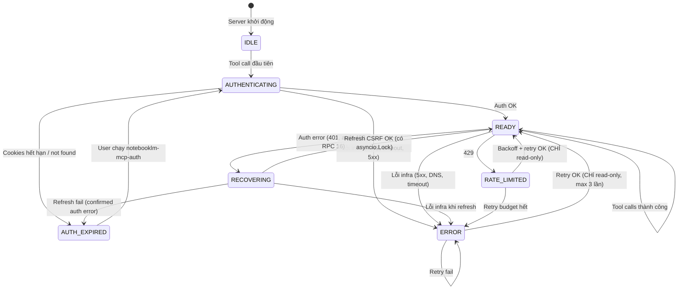

# Build Reliable NotebookLM MCP Server for Antigravity

## Problem

MCP hiện tại dùng **Selenium browser automation** → fragile.  
Có sẵn `api_client.py` — **HTTP API Client** dùng cookies, KHÔNG cần browser.

## State Machine

### Error Classification

| Code | Phân loại | Hành vi |
|------|-----------|---------|
| 401 | Auth failure | → RECOVERING |
| 403 + body chứa `"UNAUTHENTICATED"` hoặc `"LOGIN_REQUIRED"` | **Auth** failure | → RECOVERING |
| 403 + body chứa `"PERMISSION_DENIED"` hoặc không có auth marker | **Authorization** error | → trả lỗi "Permission denied" |
| RPC Error 16 | Auth failure | → RECOVERING |
| Other RPC errors | Unknown/Infra | → ERROR |
| 429 | Rate limited | → RATE_LIMITED |
| 5xx, DNS, timeout | Infra failure | → ERROR |

### Retry Safety & Budget

| Tool | Type | Auto-retry? | Budget |
|------|------|-------------|--------|
| `healthcheck` | Local | N/A (no API call) | N/A |
| `list_notebooks`, `get_notebook`, `query_notebook`, `get_notebook_summary` | Read | ✅ Max 3 lần, 30s max | Exponential backoff + jitter |
| `create_notebook`, `rename_notebook`, `delete_notebook`, `add_url_source`, `add_text_source` | Write | ❌ No retry | Return error ngay |

### Concurrency: `asyncio.Lock` bảo vệ AUTHENTICATING/RECOVERING

## Tools

| Tool | Mô tả |
|------|--------|
| `healthcheck` | Pure local state read (KHÔNG trigger auth/API) |
| `list_notebooks` | Liệt kê notebooks |
| `get_notebook` | Chi tiết notebook |
| `create_notebook` | Tạo notebook mới |
| `rename_notebook` | Đổi tên notebook |
| `delete_notebook` | Xóa notebook |
| `query_notebook` | Q&A có citations |
| `add_url_source` | Thêm source từ URL |
| `add_text_source` | Thêm source từ text |
| `get_notebook_summary` | Tóm tắt notebook |

## Files

| Action | File |
|--------|------|
| NEW | `server.py` — FastMCP server + state machine |
| NEW | `run_mcp.py` — Entry point (banner filter) |
| MODIFY | `mcp_config.json` — Cập nhật config |

## Verification

### Happy Path
1. Server start → IDLE
2. List tools → 10 tools  
3. `list_notebooks` → IDLE→AUTHENTICATING→READY

### Error Paths
4. Expired cookies → AUTH_EXPIRED + clear message
5. NotebookLM 5xx → ERROR (NOT AUTH_EXPIRED)
6. 429 → RATE_LIMITED → backoff → retry (read only)
7. `create_notebook` fail → NO retry, immediate error
8. Concurrent calls during RECOVERING → Lock serializes
9. Permission-denied 403 → trả "Permission denied" (NOT re-auth)
10. Retry budget exhausted → return error after max 3 attempts

### Healthcheck-specific
11. From IDLE → return state only, NO auth trigger
12. From AUTH_EXPIRED → return state + guidance, NO API call
13. From ERROR → return state + error info, NO API call
